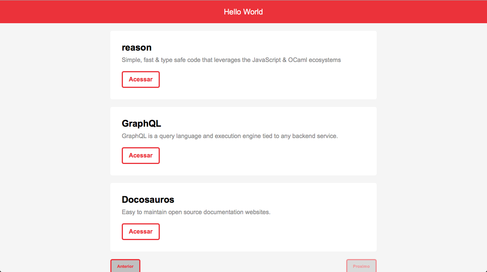
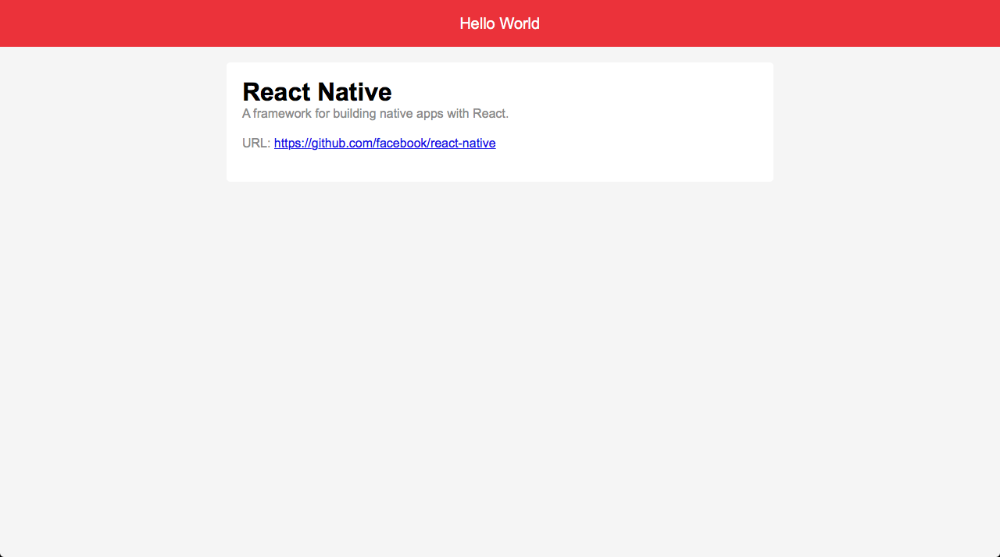

<p align="center">	
   <a href="https://www.linkedin.com/in/pablo-rosa-68136a1b2/">
      
   </a>
  


  <a href="https://github.com/PabloRSantos/proffy/commits/master">
    
</p>


# :pushpin: Índice

- [Sobre](#sobre)
- [Tecnologias Utilizadas](#tecnologias-utilizadas)
- [Como Usar](#como-usar)
- [Como Contribuir](#como-contribuir)

<a id="sobre"></a>

## :bookmark: Sobre

O <strong>Primeiro React</strong> é uma aplicação Web feita para treinar ReactJS.

Essa aplicação foi construída seguindo os videos de ReactJS iniciante encontrados no site da [Rocketseat](https://rocketseat.com.br/). 

<a id="tecnologias-utilizadas"></a>

## :rocket: Tecnologias Utilizadas

O projeto foi desenvolvido utilizando as seguintes tecnologias

- [JavaScript](http://javascript.com)
- [ReactJS](https://reactjs.org/)
- [Axios](https://www.axios.com)

## :heavy_check_mark: :computer: Resultado Web


<h1 align="center">
    
    
    
</h1>

<a id="como-usar"></a>

# :construction_worker: Como Usar

### **Pré-requisitos**

  - É **necessário** possuir o **[Node.js](https://nodejs.org/en/)** instalado na máquina
  - Também, é **preciso** ter um gerenciador de pacotes seja o **[NPM](https://www.npmjs.com/)** ou **[Yarn](https://yarnpkg.com/)**.

```bash
# Clone o Repositório
$ git clone https://github.com/PabloRSantos/PrimeiroReact.git
```


```bash
# Entre na pasta
$ cd PrimeiroReact

# Instale as dependências
$ yarn install ou npm install

# Execute a aplicação
$ yarn start ou npm start
```
Vá para http://localhost:3000/ para ver o resultado.

<a id="como-contribuir"></a>

## :recycle: Como contribuir

- Faça um Fork desse repositório,
- Crie uma branch com a sua feature: `git checkout -b my-feature`
- Commit suas mudanças: `git commit -m 'feat: My new feature'`
- Push a sua branch: `git push origin my-feature`

## :mortar_board: Quem ministrou?

As aulas foram ministradas por **[Diego Fernandes](https://github.com/diego3g)**


---

<h4 align="center">
    Feito com 💜 by <a href="https://www.linkedin.com/in/pablo-rosa-68136a1b2/" target="_blank">Pablo Rosa</a>
</h4>
